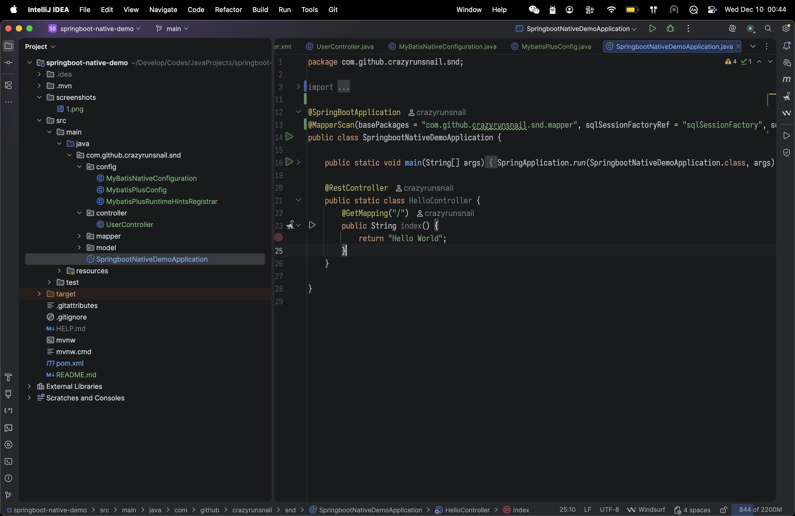

[English](./README.md)
# Spring Boot 原生应用与 MyBatis-Plus 集成示例

一个集成了 Spring Boot、Spring Native 和 MyBatis-Plus 的最小化示例项目。本项目展示了如何结合使用原生编译的速度优势与 Spring Boot 和 MyBatis-Plus 的开发效率。



## 功能特性

- 基于 Spring Boot 3.x 的原生应用
- 集成 MyBatis-Plus
- 使用 PostgreSQL 数据库
- 原生镜像配置

## 环境要求

- Java 21 或更高版本
- Maven
- Docker（用于构建原生镜像）
- PostgreSQL 数据库

## 项目搭建

### 1. 创建项目

使用 [Spring Initializer](https://start.spring.io/) 创建新项目，选择以下依赖：
- Spring Web
- Lombok
- PostgreSQL
- GraalVM Native Support

### 2. 添加 Native 插件

在 `pom.xml` 中添加：

```xml
<plugin>
    <groupId>org.graalvm.buildtools</groupId>
    <artifactId>native-maven-plugin</artifactId>
</plugin>